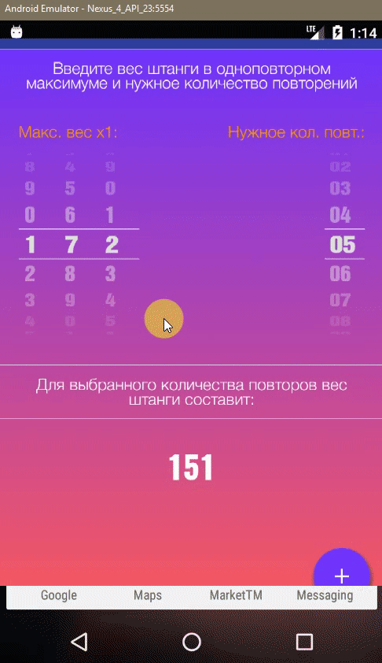

<p align="center">
  <a href="https://github.com/DavidTavis/1RM" target="_blank">
    
  </a>
</p>
<h1 align="center">1 RM calculator</h1>


<p align="center">
  
</p>

## Stack of technologies

```sh
ScheduledExecutorService, Handler, GestureDetector, Canvas, Paint, Rect, Vibrator, AudioManager
```

## Description

```bash
Description
```

## Created by
[David Tarielashvili](https://www.facebook.com/profile.php?id=100004118055733&ref=bookmarks)
